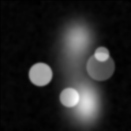
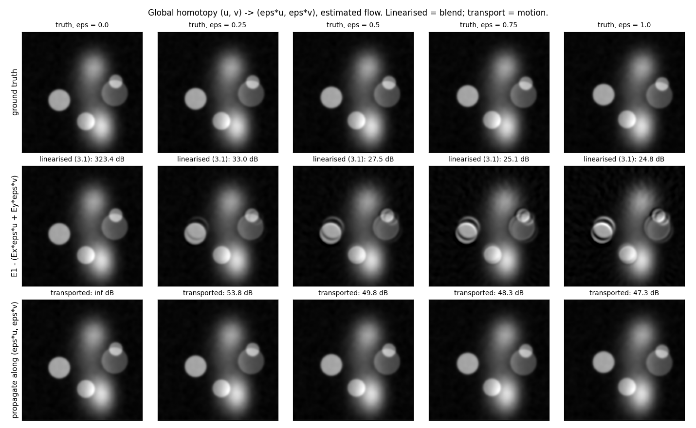
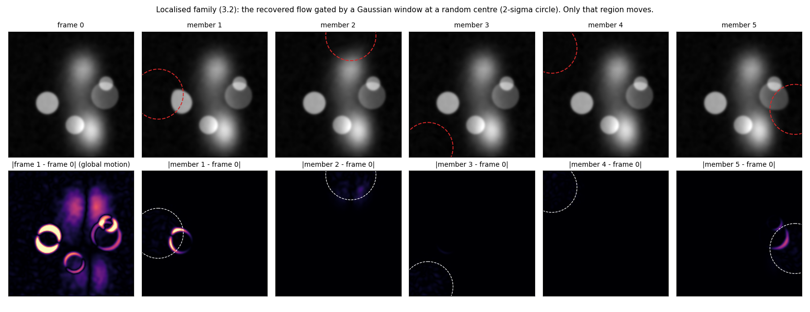
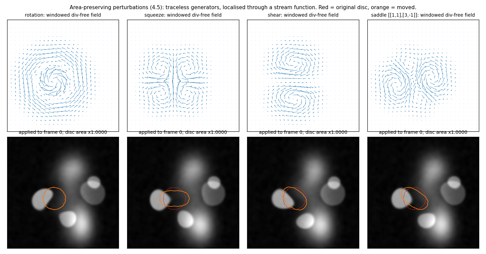
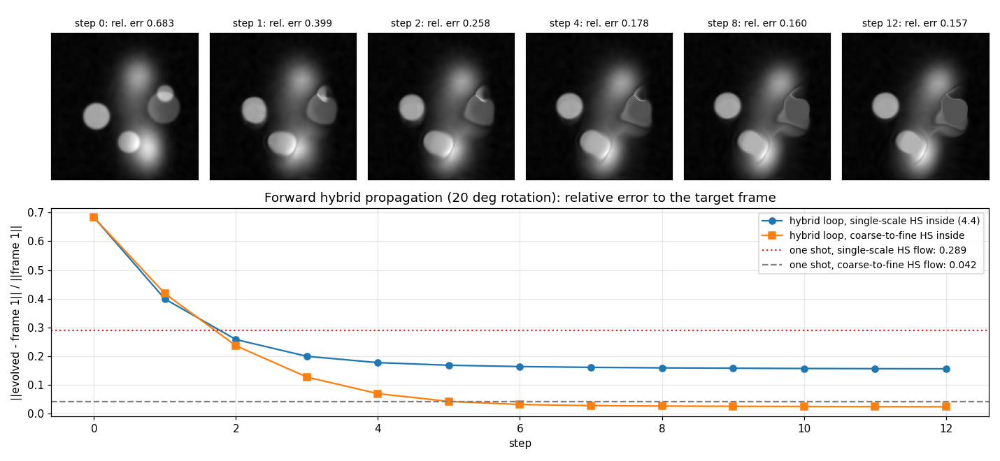

# Optical flow as an inverse problem — and as a generator of new images

[](https://github.com/JCMontalbo/optical-flow-inverse/actions/workflows/ci.yml)

Two frames of a scene contain more than two images. Recover the motion field between them (an
ill-posed inverse problem), transform that field in ways that respect the geometry of the scene, and
propagate the first frame along the result: you get a *family* of new, plausible images — variation only
where motion has been shown to be possible, unlike blind rotate/skew/shear augmentation.

This is a from-scratch NumPy/SciPy implementation of my PhD dissertation, *Inverse Problems and Forward
Propagation of Optical Flow* (UT Arlington, 2020), on synthetic data with exact ground truth. Every number
below is regenerated by two scripts; a third runs the whole pipeline on any two frames of your own.

<p align="center">

</p>

*Frame 0 transported along `ε·(u, v)` for ε sweeping 0 → 1 → 0, using the flow **estimated** from the pair.*

## The pipeline

**Inverse problem.** Brightness constancy, `I1(x+u, y+v) = I0(x, y)`, linearises to one equation per pixel
in two unknowns, `I_x u + I_y v + I_t = 0`; it fixes only the component of motion along the image gradient
(the aperture problem). Horn and Schunck (1981) regularise it:

```
E(u, v) = ∫ (I_x u + I_y v + I_t)²  +  α² ( |∇u|² + |∇v|² ) dx
```

The Euler–Lagrange equations are a coupled pair of Poisson-type PDEs; discretising the Laplacian as a local
mean gives the Jacobi iteration in [`ofi/horn_schunck.py`](ofi/horn_schunck.py), plus a coarse-to-fine
pyramid for motions larger than the linearisation allows.

**Forward problem.** Given `I0` and a field, brightness constancy is a transport equation,
`∂I/∂τ + u ∂I/∂x + v ∂I/∂y = 0`. Solving it to time `t` gives the frame at any instant
([`ofi/propagate.py`](ofi/propagate.py)); solving it along a *modified* field gives a frame that never
existed ([`ofi/augment.py`](ofi/augment.py)). The dissertation's contribution is the second half.

## Results — generating new images (dissertation ch. 3–4)

All figures: `python scripts/run_augmentation.py` (≈12 s). 160×160 phantom of soft discs and blobs on a
textured background, moved by an 8° rotation plus a (4, −3) px translation; the flow is *estimated* from
the pair by coarse-to-fine Horn–Schunck, not taken from ground truth.

### §3.1 Global homotopy `(u, v) → (εu, εv)` — and why transport beats the linearised update



The dissertation shows that under the linearised reconstruction `Ẽ₂ = E₁ − (E_x εu + E_y εv)` the ε-family
collapses to the blend `εE₂ + (1−ε)E₁`: regions dim and brighten in place instead of moving (§3.1, §4.4).
Propagating along `(εu, εv)` with the transport solver moves them.

| ε | linearised reconstruction | transport along `(εu, εv)` |
|---|---|---|
| 0.25 | 33.0 dB | **53.8 dB** |
| 0.50 | 27.5 dB | **49.8 dB** |
| 0.75 | 25.1 dB | **48.3 dB** |
| 1.00 | 24.8 dB | **47.3 dB** |

(PSNR against the true frame at the corresponding fraction of the motion.)

### §3.2 Localised change — one new image per window



Multiply the recovered field by a Gaussian window `f_s` at a random centre: only that region moves, and
each centre gives a different member of the family. The bottom row shows what changed. This is the
dissertation's data-augmentation primitive: the motion is real (it came from the pair), only its support is
chosen.

### §4.5 Area-preserving perturbations



Brightness constancy is a conservation law — pixels move, they do not appear or vanish — so admissible
perturbations should preserve area. In the affine case these are the special affine maps, generated by
**traceless** `A` (`λ₁ = −λ₂`) through `x(t) = exp(At) x₀`, since `det exp(At) = exp(t·tr A)`: rotation,
squeeze, shear, and the dissertation's `[[1, 1], [3, −1]]` example (eq. 4.15–4.18).

The implementation adds one step beyond the dissertation: to *localise* such a perturbation while keeping
it exactly area-preserving, window the **stream function** `ψ_A` (which exists iff `tr A = 0`) rather than the
field, and take `∇⊥(f·ψ_A)`. Windowing the field directly (`f·Ax`) breaks divergence-freeness because
`∇f·Ax ≠ 0`. Measured on a disc mask moved by each perturbation:

| generator | area after / before, stream-function window | naive window `f·Ax` |
|---|---|---|
| rotation | 1.0000 | 0.969 |
| squeeze | 1.0000 | 0.993 |
| shear | 1.0000 | 0.991 |
| saddle | 1.0000 | 1.019 |

### §4.2–4.4 Explicit pixel movement and the hybrid loop



For large motion a single flow estimate is not accurate enough. The dissertation's remedy: re-estimate the
flow between the *evolved* image and the target after every short step, Gaussian-smooth it so pixels move
coherently, and repeat — the intermediate frames are the "in-between" data. On a 20° rotation:

| method | relative error to frame 1 |
|---|---|
| one shot, single-scale HS | 0.289 |
| hybrid loop, single-scale HS inside (the dissertation's scheme) | 0.157 |
| one shot, coarse-to-fine HS | 0.042 |
| **hybrid loop, coarse-to-fine HS inside** | **0.025** |

The loop is a *temporal* analogue of coarse-to-fine — short steps keep each linearisation valid — and the
two compose: the hybrid loop with a pyramid inside beats either alone. With single-scale HS it plateaus
with the shape distortions the dissertation reports in Fig. 4.21–4.22.

`ofi.augment.propagate_ode` implements §4.2's pixel-movement ODE (`dx/dt = u, dy/dt = v`) with the standard
Euler step, the non-standard Euler step `x ← x + (1 − e^{−γΔt}) u/γ` of §4.4, and a midpoint (RK2) option.

### §3.3 When is the motion observable?

The dissertation notes that the reconstruction needs image gradients to act on: a piecewise-constant
phantom must have noise added before the method works. The robust form of that claim, tested in
[`tests/test_augment.py`](tests/test_augment.py): a flat disc rotating 5° is **invisible** (recovered flow
inside it has endpoint error 1.47 px on 1.39 px of true motion — nothing recovered), while the same disc
with texture gives 0.11 px.

## Results — the inverse problem itself

`python scripts/run_experiments.py` (≈35 s), 128×128 smooth random texture. Endpoint error (EPE) is the mean
|estimated − true| displacement in pixels, excluding an 8-px border.

<details>
<summary>Flow recovery, regularisation sweep, pyramid vs. single scale, convergence, interpolation</summary>


*A 2.5° rotation recovered by coarse-to-fine Horn–Schunck: EPE 0.096 px on a field of mean magnitude 1.9 px.*

**The regulariser is a bias–variance knob, and α is dimensionful.** α² competes with `I_x² + I_y²`, so the
right value scales with the image's intensity range; `α = 0.1` assumes images in [0, 1]. For a uniform
translation the true field is perfectly smooth and more regularisation is always better (EPE 0.006 px at
α = 1); for rotation the curve turns (best α ≈ 0.56, EPE 0.056 px).


**Linearised brightness constancy breaks past ~2 px; a pyramid fixes it.**

| true displacement | single scale | pyramid (3 levels) |
|---|---|---|
| 0.5 px | **0.016** | 0.072 |
| 2 px | 0.176 | **0.107** |
| 4 px | 1.018 | **0.177** |
| 8 px | 4.021 | **0.304** |


**Convergence slows as α grows** (Jacobi propagates information one pixel per sweep).


**Forward propagation beats blending for frame interpolation.** At t = 0.5 of a 4° rotation: linear blend
35.4 dB, upwind advection 42.1 dB, semi-Lagrangian along the *estimated* flow 56.2 dB.


</details>

## Run it on your own frames

```bash
pip install -e ".[dev]"
python scripts/augment_pair.py frame0.png frame1.png --out out/
```

Any two successive frames (colour is converted to grey, and the longer side is downscaled to `--max-size`,
default 384). Writes the recovered flow, the ε-homotopy as PNG and GIF, `--n` localised family members, the
four area-preserving perturbations applied at the point of largest motion, and `flow.npz` for your own
experiments. `--width`, `--gain`, `--amplitude` control the window size, how much the windowed region
moves, and the perturbation strength.

```bash
pytest                               # 28 tests, ~4 s
python scripts/run_augmentation.py   # figures for ch. 3–4
python scripts/run_experiments.py    # figures for the inverse problem
```

```python
from ofi import make_phantom, make_pair, rigid_flow, horn_schunck_pyramid, propagate_semi_lagrangian
from ofi.augment import scale_flow, localized_family, area_preserving_perturbation, SHEAR, propagate_ode

ph = make_phantom((160, 160))
_, finv = rigid_flow(ph.shape, angle_deg=8, dx=4, dy=-3)
i0, i1 = make_pair(ph, finv)                           # exact ground truth
u, v = horn_schunck_pyramid(i0, i1)                    # inverse problem

half = propagate_semi_lagrangian(i0, *scale_flow(u, v, 0.5), 1.0)        # 3.1
members = localized_family(u, v, n=5, width=16, rng=0)                    # 3.2
du, dv = area_preserving_perturbation(ph.shape, SHEAR, (60, 90), 16, 5)   # 4.5
sheared = propagate_ode(i0, u + du, v + dv, 1.0, method="midpoint")
```

## Layout

```
ofi/
  synthetic.py      textures, phantoms, analytic motions with exact flow, image pairs
  horn_schunck.py   single-scale solver + coarse-to-fine pyramid
  propagate.py      upwind and semi-Lagrangian transport
  augment.py        ch. 3-4: homotopy, localisation, advection norms, pixel-movement ODE,
                    hybrid loop, area-preserving generators and their windowed extension
  metrics.py        endpoint error, angular error, PSNR
scripts/
  run_augmentation.py   figures and numbers for ch. 3-4
  run_experiments.py    figures and numbers for the inverse problem
  augment_pair.py       the pipeline on two frames of your own
tests/                  28 tests on synthetic ground truth, one per claim above
```

## Background

The dissertation was motivated by segmentation of pelvic MRI (a UT Arlington – UT Southwestern Radiology
and Urology collaboration), where labelled training data is scarce and standard augmentation ignores whether
a rotation or shear is anatomically viable. Two applications: generating deliberately modified but
geometry-respecting synthetic slices for training, and approximating intermediate slices between acquired
ones. The clinical data cannot be shared, so this repository demonstrates the methods on synthetic scenes
where the truth is known exactly and every claim is checkable.

- J. Montalbo, *Inverse Problems and Forward Propagation of Optical Flow*, PhD dissertation, UT Arlington, 2020.
  [MavMatrix](https://mavmatrix.uta.edu/math_dissertations/241).
- B. K. P. Horn and B. G. Schunck, "Determining optical flow," *Artificial Intelligence* 17 (1981).
- J. L. Barron, D. J. Fleet, S. S. Beauchemin, "Performance of optical flow techniques," *IJCV* 12 (1994).
- D. T. Dimitrov and H. V. Kojouharov, non-standard finite-difference schemes (the non-standard Euler step of §4.4).

MIT license.
