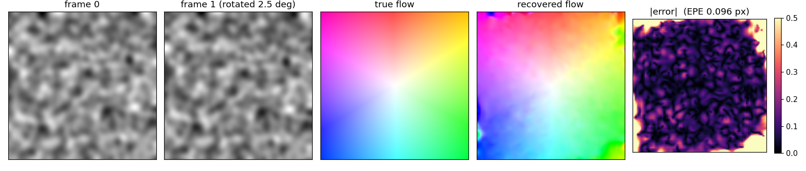
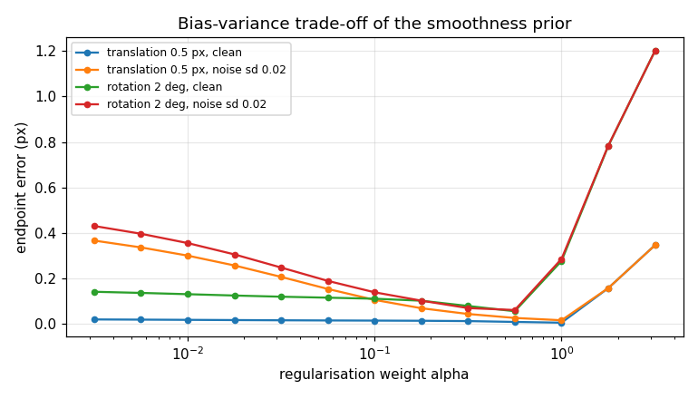
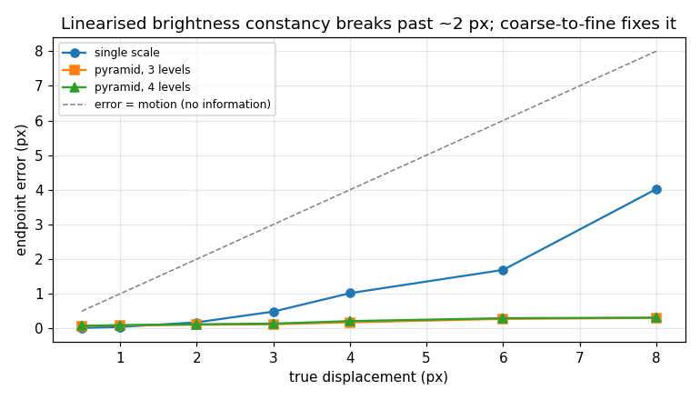
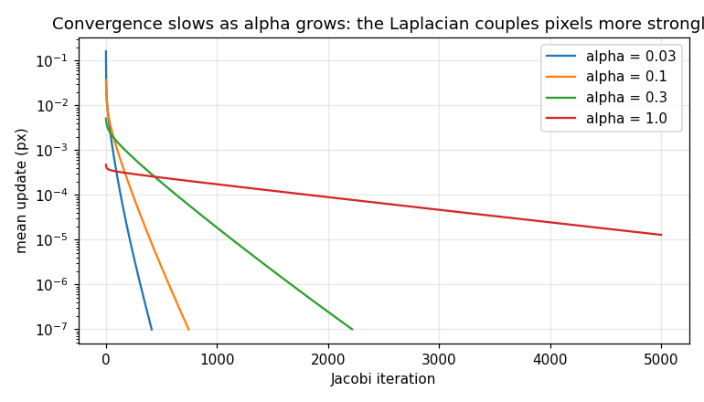
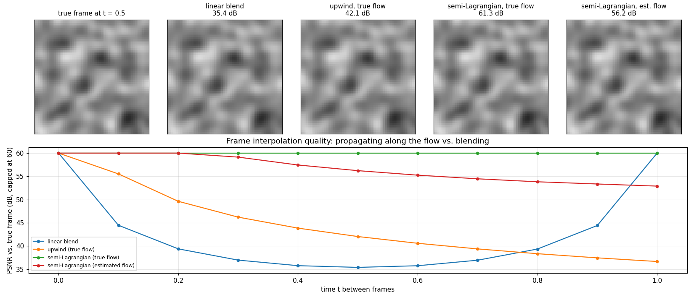

# Optical flow as an inverse problem

[](https://github.com/JCMontalbo/optical-flow-inverse/actions/workflows/ci.yml)

Variational motion estimation (Horn–Schunck) and forward propagation of image information along the
recovered field — a from-scratch NumPy/SciPy implementation of the two halves of my PhD dissertation,
*Inverse Problems and Forward Propagation of Optical Flow* (UT Arlington, 2020), measured on synthetic
data with exact ground truth.



*A 2.5° rotation recovered by coarse-to-fine Horn–Schunck: mean endpoint error 0.096 px on a field whose
mean magnitude is 1.9 px. Errors concentrate at the image boundary, where no information arrives.*

## The problem

Two frames of a scene, `I0` and `I1`. Find the per-pixel displacement `(u, v)` that carries one to the other.

Brightness constancy, `I1(x + u, y + v) = I0(x, y)`, linearises to one equation per pixel in two unknowns:
`I_x u + I_y v + I_t = 0`. It fixes only the component of motion along the image gradient — the **aperture
problem** — so the inverse problem is ill-posed. Horn and Schunck (1981) regularise it by asking for the
smoothest field consistent with the data:

```
E(u, v) = ∫ (I_x u + I_y v + I_t)²  +  α² ( |∇u|² + |∇v|² ) dx
```

The Euler–Lagrange equations are a coupled pair of Poisson-type PDEs; discretising the Laplacian as a
local mean gives the Jacobi iteration in [`ofi/horn_schunck.py`](ofi/horn_schunck.py).

The **forward** problem runs the other way. Given `I0` and a flow, brightness constancy is a transport
equation, `∂I/∂τ + u ∂I/∂x + v ∂I/∂y = 0`, and solving it to time `τ = t` yields the frame at any instant
between the two we observed. [`ofi/propagate.py`](ofi/propagate.py) has two discretisations: explicit upwind
finite differences, and semi-Lagrangian characteristic tracing.

## Results

All numbers come from `python scripts/run_experiments.py` (≈35 s on a laptop) on a 128×128 smooth random
texture. Endpoint error (EPE) is the mean |estimated − true| displacement in pixels, excluding an 8-px border.

### 1. The regulariser is a bias–variance knob — and α is dimensionful



| motion | best α | EPE at best α |
|---|---|---|
| translation 0.5 px, clean | 1.0 (largest tried) | 0.006 px |
| translation 0.5 px, noise σ = 0.02 | 1.0 | 0.017 px |
| rotation 2°, clean | 0.56 | 0.056 px |
| rotation 2°, noise σ = 0.02 | 0.56 | 0.062 px |

For a uniform translation the true field is perfectly smooth, so more regularisation is always better.
For rotation the field has structure and the curve turns: too small an α leaves the aperture problem
unresolved, too large smears the field. Note that α² competes with `I_x² + I_y²`, so the right value
scales with the image's intensity range — the default `α = 0.1` assumes images in [0, 1].

### 2. Linearised brightness constancy breaks past ~2 px; a pyramid fixes it



| true displacement | single scale | pyramid (3 levels) |
|---|---|---|
| 0.5 px | **0.016** | 0.072 |
| 1 px | **0.044** | 0.089 |
| 2 px | 0.176 | **0.107** |
| 4 px | 1.018 | **0.177** |
| 8 px | 4.021 | **0.304** |

The linearisation is only valid for sub-pixel motion. Solving coarse-to-fine on a Gaussian pyramid, warping
frame 1 by the current estimate before solving for a correction, extends the method to displacements of
several pixels — at the cost of some precision on sub-pixel motion, where the downsampling and warping
interpolation introduce their own error. Use single-scale below ~1.5 px, the pyramid above.

### 3. Convergence slows as α grows



Jacobi iteration on a Poisson-type problem propagates information one pixel per sweep; the larger α, the
more the solution depends on distant pixels and the longer it takes. (A multigrid or conjugate-gradient
solver would fix this; it is not the point of this repo.)

### 4. Forward propagation beats blending for frame interpolation



| method for the frame at t = 0.5 (4° rotation) | PSNR vs. truth |
|---|---|
| linear blend of `I0` and `I1` | 35.4 dB |
| upwind advection, true flow | 42.1 dB |
| semi-Lagrangian, true flow | 61.3 dB |
| semi-Lagrangian, **estimated** flow | **56.2 dB** |

Blending two frames produces a double image. Transporting `I0` along the flow — even the flow we estimated
from the pair, not the true one — gives a 21 dB better in-between frame. The upwind scheme lands in the
right place but is numerically diffusive (first-order accurate), which is why the semi-Lagrangian method
is the one to use.

## Run it

```bash
pip install -e ".[dev]"
pytest                              # 15 tests, ~2 s
python scripts/run_experiments.py   # regenerates figures/ and prints the tables above
```

```python
from ofi import make_texture, rotation_flow, make_pair, horn_schunck_pyramid, propagate_semi_lagrangian

tex = make_texture((128, 128))
(u_true, v_true), finv = rotation_flow(tex.shape, angle_deg=2.5)
i0, i1 = make_pair(tex, finv)              # exact ground truth
u, v = horn_schunck_pyramid(i0, i1)        # inverse problem
i_half = propagate_semi_lagrangian(i0, u, v, t=0.5)   # forward problem
```

## Layout

```
ofi/
  synthetic.py      textures, analytic motions with exact flow, image pairs
  horn_schunck.py   single-scale solver + coarse-to-fine pyramid
  propagate.py      upwind and semi-Lagrangian transport
  metrics.py        endpoint error, angular error, PSNR
scripts/run_experiments.py   every figure and number above
tests/                       correctness on synthetic ground truth
```

## Background

The dissertation applied this machinery to de-identified pelvic MRI sequences: estimate anatomical motion
between slices, then propagate image information to synthesise intermediate or higher-resolution views.
That data cannot be shared, so this repo demonstrates the methods on synthetic motions where the truth is
known exactly and every claim above is checkable.

- B. K. P. Horn and B. G. Schunck, "Determining optical flow," *Artificial Intelligence* 17 (1981).
- J. L. Barron, D. J. Fleet, S. S. Beauchemin, "Performance of optical flow techniques," *IJCV* 12 (1994) — angular error.
- J. Montalbo, *Inverse Problems and Forward Propagation of Optical Flow*, PhD dissertation, UT Arlington, 2020.

MIT license.
