# Optical flow as an inverse problem — and as a generator of new images

[](https://github.com/JCMontalbo/optical-flow-inverse/actions/workflows/ci.yml)

Two frames of a scene contain more than two images. Recover the motion field between them — an ill-posed
inverse problem — transform that field in ways that respect the geometry of the scene, and propagate the
first frame along the result: you get a *family* of new, plausible images, with variation only where motion
has been shown to be possible. That was the idea of my PhD dissertation, *Inverse Problems and Forward
Propagation of Optical Flow* (UT Arlington, 2020). I proposed it as training-data augmentation for medical
imaging, where you cannot flip or rotate a slice without producing an impossible patient, and I ran out of
time before I could test that claim.

This repository is the dissertation built from scratch in NumPy/SciPy, on synthetic data with exact ground
truth, then taken to real video, then taken to the test I never ran. I wrote the pass/fail lines into git
before each experiment ([docs/](docs/)), so the misses are here next to the hits. Every number is
regenerated by a script in `scripts/`; two of the scripts run the whole pipeline on frames or video of your
own.

<p align="center">

</p>

*Frame 0 transported along `ε·(u, v)` for ε sweeping 0 → 1 → 0, using the flow **estimated** from the pair.*

## The two halves

**The inverse problem.** Brightness constancy, `I1(x+u, y+v) = I0(x, y)`, linearises to one equation per
pixel in two unknowns, `I_x u + I_y v + I_t = 0`. It fixes only the component of motion along the image
gradient — the aperture problem — so the problem is ill-posed. Horn and Schunck (1981) regularise it:

```
E(u, v) = ∫ (I_x u + I_y v + I_t)²  +  α² ( |∇u|² + |∇v|² ) dx
```

The Euler–Lagrange equations are a coupled pair of Poisson-type PDEs; discretising the Laplacian as a local
mean gives the Jacobi iteration in [`ofi/horn_schunck.py`](ofi/horn_schunck.py), plus a coarse-to-fine
pyramid for motions larger than the linearisation allows.

**The forward problem.** Given `I0` and a field, brightness constancy is a transport equation,
`∂I/∂τ + u ∂I/∂x + v ∂I/∂y = 0`. Solving it to time `t` gives the frame at any instant
([`ofi/propagate.py`](ofi/propagate.py)); solving it along a *modified* field gives a frame that never
existed ([`ofi/augment.py`](ofi/augment.py)). The second half is what the dissertation was about.

## Generating new images (dissertation chapters 3–4)

All figures: `python scripts/run_augmentation.py` (≈15 s). A 160×160 phantom of soft discs and blobs on a
textured background, moved by an 8° rotation plus a (4, −3) px translation; the flow is *estimated* from
the pair by coarse-to-fine Horn–Schunck, not taken from ground truth.

### §3.1 The global homotopy `(u, v) → (εu, εv)`, and why transport beats the linearised update


In §3.1 I showed that under the linearised reconstruction `Ẽ₂ = E₁ − (E_x εu + E_y εv)` the ε-family
collapses to the blend `εE₂ + (1−ε)E₁`: regions dim and brighten in place instead of moving, which is the
flaw I describe in §4.4. Propagating along `(εu, εv)` with the transport solver moves them.

| ε | linearised reconstruction | transport along `(εu, εv)` |
|---|---|---|
| 0.25 | 33.0 dB | **53.8 dB** |
| 0.50 | 27.5 dB | **49.8 dB** |
| 0.75 | 25.1 dB | **48.3 dB** |
| 1.00 | 24.8 dB | **47.3 dB** |

(PSNR against the true frame at the corresponding fraction of the motion.)

### §3.2 Localised change — one new image per window


Multiply the recovered field by a Gaussian window `f_s` at a random centre: only that region moves, and
each centre gives a different member of the family. The bottom row shows what changed. This is the
augmentation primitive from the dissertation: the motion is real, because it came from the pair; only its
support is chosen.

### §4.5 Area-preserving perturbations


Brightness constancy is a conservation law — pixels move, they do not appear or vanish — so admissible
perturbations should preserve area. In the affine case these are the special affine maps, generated by
**traceless** `A` (`λ₁ = −λ₂`) through `x(t) = exp(At) x₀`, since `det exp(At) = exp(t·tr A)`: rotation,
squeeze, shear, and the `[[1, 1], [3, −1]]` example from §4.5.

One step here goes beyond the dissertation. To *localise* such a perturbation while keeping it exactly
area-preserving, window the **stream function** `ψ_A` (which exists iff `tr A = 0`) rather than the field,
and take `∇⊥(f·ψ_A)`. Windowing the field directly (`f·Ax`) breaks divergence-freeness because
`∇f·Ax ≠ 0`. Measured on a disc mask moved by each perturbation:

| generator | area after / before, stream-function window | naive window `f·Ax` |
|---|---|---|
| rotation | 1.0000 | 0.969 |
| squeeze | 1.0000 | 0.993 |
| shear | 1.0000 | 0.991 |
| saddle | 1.0000 | 1.019 |

<p align="center">
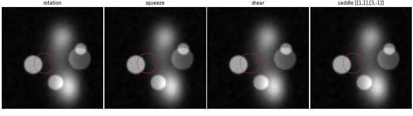
</p>

*Frame 0 under each localised perturbation as `t` sweeps 0 → 1 → 0. The red dashed contour is the
reference disc; the region deforms but its area does not change.*

### §4.2–4.4 Explicit pixel movement and the hybrid loop


For large motion a single flow estimate is not accurate enough. My remedy in chapter 4 was to re-estimate
the flow between the *evolved* image and the target after every short step, Gaussian-smooth it so pixels
move coherently, and repeat — the intermediate frames are the in-between data. On a 20° rotation:

| method | relative error to frame 1 |
|---|---|
| one shot, single-scale HS | 0.289 |
| hybrid loop, single-scale HS inside (the scheme from the dissertation) | 0.157 |
| one shot, coarse-to-fine HS | 0.042 |
| **hybrid loop, coarse-to-fine HS inside** | **0.025** |

The loop is a *temporal* analogue of coarse-to-fine — short steps keep each linearisation valid — and the
two compose: the hybrid loop with a pyramid inside beats either alone. With single-scale HS it plateaus with
the shape distortions I reported in Fig. 4.21–4.22.

`ofi.augment.propagate_ode` implements the §4.2 pixel-movement ODE (`dx/dt = u, dy/dt = v`) with the
standard Euler step, the non-standard Euler step `x ← x + (1 − e^{−γΔt}) u/γ` of §4.4, and a midpoint (RK2)
option.

### §3.3 When is the motion observable?

In §3.3 I noted that the reconstruction needs image gradients to act on: a piecewise-constant phantom had
to have noise added before the method worked. The robust form of that observation, tested in
[`tests/test_augment.py`](tests/test_augment.py): a flat disc rotating 5° is **invisible** — the recovered
flow inside it has endpoint error 1.47 px on 1.39 px of true motion, nothing recovered — while the same
disc with texture gives 0.11 px.

## In practice: streaming over a video

The framework was designed to run as frames arrive. `scripts/augment_video.py` streams through a clip: for
each consecutive pair it estimates the flow, advects a Gaussian window along the motion *relative to the
camera* so it stays on the moving subject, and emits two synthetic frames from the real frame at that
instant — one with the motion under the window amplified ×3 (§3.2), one with a localised area-preserving
swirl added to the real flow (§4.5).

<p align="center">
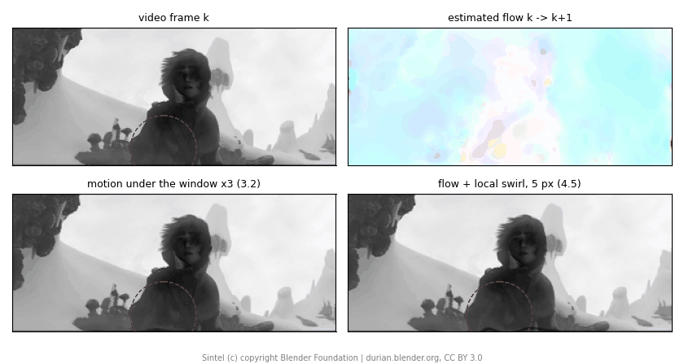
</p>

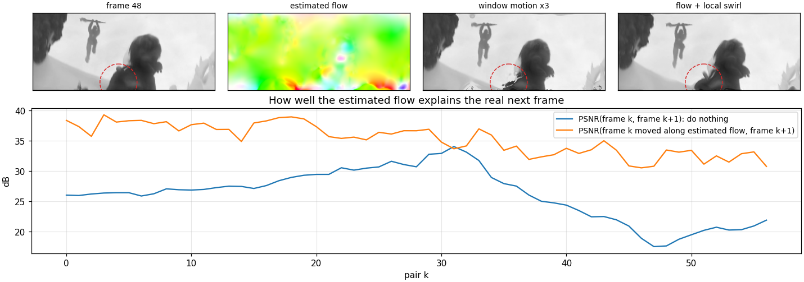

Over the 57 pairs of this shot, moving frame *k* along the estimated flow predicts the real frame *k+1* at
**35.3 dB** on average, against 26.2 dB for leaving it alone — the flow is explaining the video, not just
smoothing it. The gap narrows where the motion exceeds what Horn–Schunck can follow (pairs 45–57, up to
88 px at the frame edge).

```bash
pip install "imageio[ffmpeg]"
python scripts/augment_video.py sintel.mp4 --start 0 --end 58 --out out/ \
    --url https://test-videos.co.uk/vids/sintel/mp4/h264/360/Sintel_360_10s_1MB.mp4
```

Any MP4 works; `--gain`, `--amplitude`, `--window` set the strength and size of the modifications and
`--accumulate` chains synthetic frames instead of deriving each from the real one (the evolution setting
from chapter 4, which drifts the way Fig. 4.21–4.22 show). About 3 s per pair at 320 px wide.

### Creating new video data

`scripts/synthesize_video.py` goes further than modifying frames as they pass — it creates data that was
not in the clip, in the two senses the dissertation set out.

**New frames, validated against reality.** Hold out every odd frame, generate it by propagating the even
frame before it along the flow to the even frame after it for half the time, and compare with the real
held-out frame. Linear blending — what naive interpolation does — is the baseline.

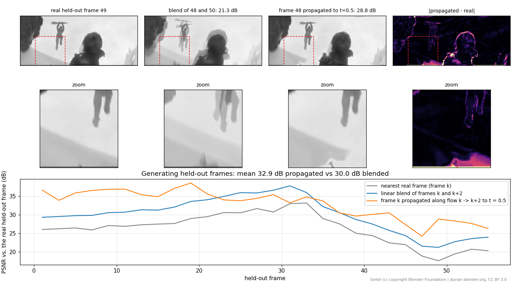

| how the held-out frame is made | mean PSNR vs. the real frame (28 frames) |
|---|---|
| nearest real frame | 26.3 dB |
| linear blend of the two neighbours | 30.0 dB |
| **propagation along the flow** | **32.9 dB** |

The blend doubles anything that moves (the hanging figure, zoomed); propagation places it once. Where the
motion is slow (frames 21–33) the blend is as good or better, since any flow error costs more than a
faint ghost. The same machinery gives 4× slow motion — three new frames between every real pair:

<p align="center">
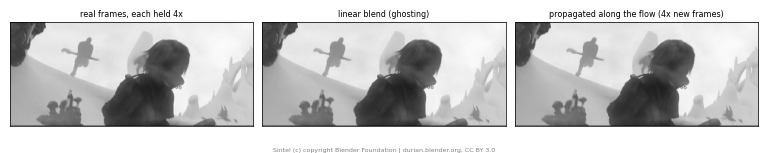
</p>

**New videos of the same scene.** A family of synthetic clips in which the motion is modified
*persistently*: the tracked region moves 3× faster, or is frozen while everything else moves, or pulses
under a swirl, squeeze or shear. The deviation from the real motion is accumulated frame to frame (advected
along the flow with a memory of 0.9 and capped at 10% of the frame height), and each synthetic frame is a
single resampling of the real frame at that instant — so the clips diverge from the original without
accumulating blur.

<p align="center">
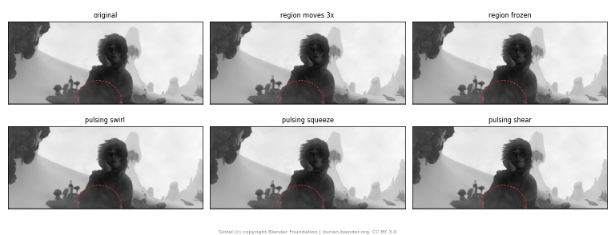
</p>

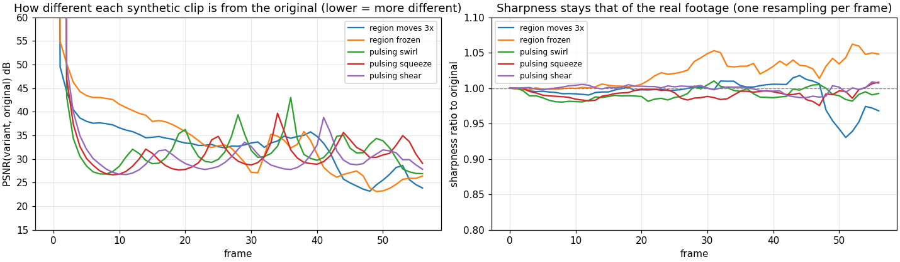

By the end of the clip the variants sit 24–29 dB from the original (the "region moves 3×" clip is the
furthest) while their sharpness stays within a few percent of the real footage.

```bash
python scripts/synthesize_video.py sintel.mp4 --start 0 --end 58 --out out/ \
    --url https://test-videos.co.uk/vids/sintel/mp4/h264/360/Sintel_360_10s_1MB.mp4
```

### Labels ride along

A segmentation label is an image on the same grid, so it transports along a flow exactly as intensities do
([`ofi/labels.py`](ofi/labels.py): one-hot channels, linear interpolation, hardened by argmax). This is
what makes generated data *trainable*: every synthetic frame comes with its label, and a label drawn on one
video frame can be carried to its neighbours. The clip has no ground-truth masks, so the score is against
a per-frame pseudo-label (the character's silhouette, tracked from frame to frame).

<p align="center">
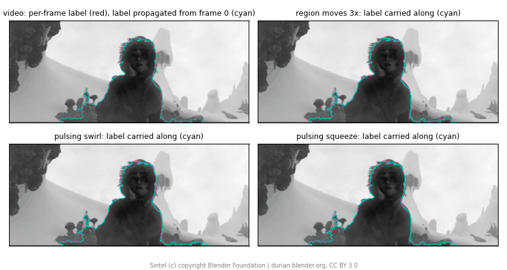
</p>

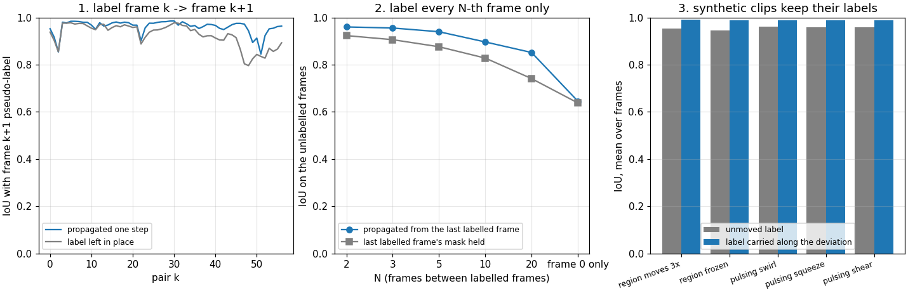

| experiment | propagated | baseline |
|---|---|---|
| 1. label frame *k*, carry to *k+1* (57 pairs) | **0.961** IoU | 0.927 (label left in place) |
| 2. label every 5th frame, carry to the frames between | **0.940** | 0.876 (hold the last label) |
| 2. label every 10th frame | **0.897** | 0.828 |
| 2. label every 20th frame | **0.852** | 0.741 |
| 2. label frame 0 only, carry through all 57 | 0.646 | 0.638 |
| 3. synthetic clips: label carried along the same deviation as the image, vs. the synthetic frame's own silhouette (5 variants) | **0.987–0.990** | 0.946–0.963 (unmoved label) |

The fifth row is the boundary: a single label chained across a whole shot in which the character turns
and new parts of her come into view is no better than holding it still — a flow can move a label, it cannot
invent one. Label every 10–20 frames and propagate in between, and it is 7–11 IoU points better than the
alternative. Row 3 is the one that matters for augmentation: the carried label matches the deformed
silhouette at 0.99.

```bash
python scripts/propagate_labels.py sintel.mp4 --start 0 --end 58 --out out/
```

*Clip: [Sintel](https://durian.blender.org) © Blender Foundation, CC BY 3.0.*

## Does it help training? First test: natural video, and why that was the wrong arena

The claim that motivated my dissertation is that flow-generated (image, label) pairs are better training
data than blind rotate/skew/shear augmentation when labels are scarce. I pre-registered a test of it
([docs/downstream_plan.md](docs/downstream_plan.md), committed before any run) on DAVIS 2016: a small
U-Net trained with 1, 2 or 20 labelled frames per video, three seeds, scored by J-mean on the 20 standard
val videos. Code in [`experiments/downstream/`](experiments/downstream/).

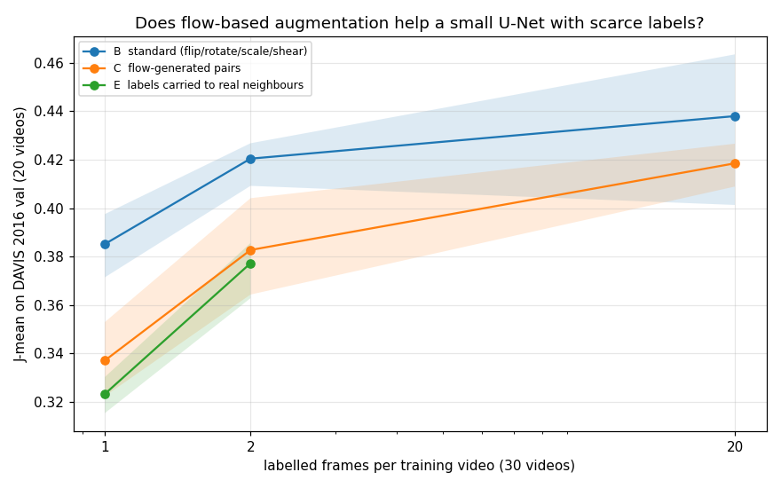

| labels / video | standard augmentation | flow-generated pairs | labels carried to real neighbours |
|---|---|---|---|
| 1 | **0.385 ± 0.011** | 0.337 ± 0.013 | 0.323 ± 0.006 |
| 2 | **0.420 ± 0.008** | 0.383 ± 0.016 | 0.377 ± 0.010 |
| 20 | **0.438 ± 0.027** | 0.418 ± 0.007 | — |

Against my criteria: H1 not supported. Standard augmentation wins by 4–5 points at 1–2 labels/video with
disjoint seed ranges; the gap narrows to 2 points (overlapping ranges) at 20. The flow pairs beat plain
label propagation by 1.4 points at 1 label/video and 0.5 at 2. 36% of the estimated flows failed the 25 dB
reconstruction gate and were dropped.

Two things this taught me:

- **DAVIS cannot test the claim I actually made.** A flipped bear is still a bear: on natural video, blind
  geometric transforms produce *valid* images, so the baseline is never penalised for being blind. My
  argument was about anatomy, where flips and large rotations produce impossible images and augmentation
  has to come from observed motion. That test is the next section.
- **I had run the method as a fixed set of 8 pairs per frame**, generated once, while the standard arm
  drew a fresh transform every step. The recovered flow defines a continuous family of perturbations;
  sampling it on the fly is the fair implementation, and it is what the MRI experiment uses.

What the DAVIS result does show: on natural video, a fixed set of pairs from a 1981 flow method does not
beat standard augmentation, and most of what it gives you is already given by carrying labels to
neighbouring real frames.

## Second test: cardiac MRI, where a rotated heart is not a plausible patient

This is the arena I meant. MSD Task02 Heart: 20 cardiac MRI volumes, left atrium labelled; adjacent slices
are the frame pair (Fig. 3.2 of the dissertation), and the recovered flow is the anatomical change through
depth. Pre-registered in [docs/downstream_heart_plan.md](docs/downstream_heart_plan.md) before any run;
code in [`experiments/heart/`](experiments/heart/). Two things done differently from DAVIS: the method is
**sampled on the fly** — a fresh member of the recovered-flow family every training step (ε, window,
generator, amplitude all random), exactly as the baselines draw a fresh transform — and the baselines are
the ones a radiologist would accept: **no flips**, small affine, and **random elastic deformation**
(Ronneberger et al. 2015), the standard medical augmentation and the sharpest competitor, since it is
also smooth deformation, just not *observed*. All arms share the same intensity jitter; elastic and flow
peaks are both capped at 8 px. Metric is 3D Dice of the atrium over the 6 held-out patients, mean ± std
over 3 seeds.

<p align="center">
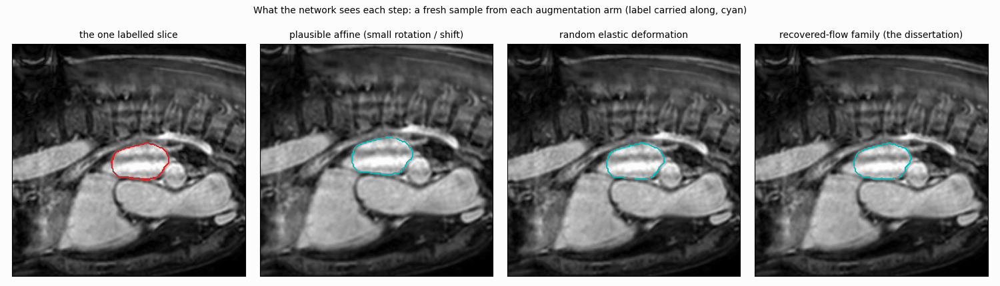
</p>

*What the network sees: one labelled slice, and each frame a fresh sample from each arm. Plausible affine
moves the whole slice; elastic wobbles it at random; the recovered-flow family deforms it the way the
anatomy actually changes between neighbouring slices, with random windows and area-preserving twists. The
label rides along in every case.*

<p align="center">
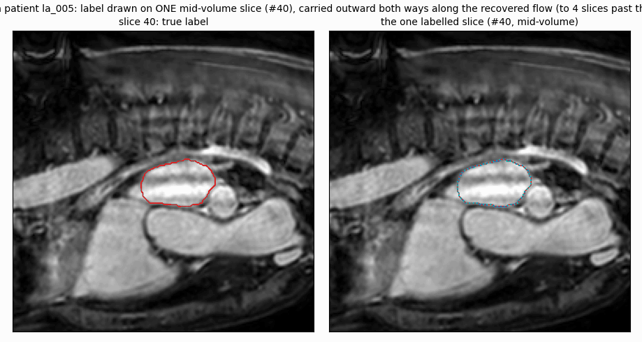
</p>

*Labels ride along in MRI too: one slice in the middle of a held-out patient's volume is labelled (#40),
and the label is carried slice by slice outward in both directions along the recovered flow (cyan) against
the true label of each slice (red). Starting mid-volume matters: an organ grows and then shrinks as you
move through the slices, so a label seeded at one end would have to survive twice the distance. It holds
for about ten slices in each direction — IoU 0.91 at 5 slices away, 0.83 at 10 — and breaks down by 20,
where the anatomy has changed beyond what a chain of slice-to-slice flows can follow.*

<p align="center">
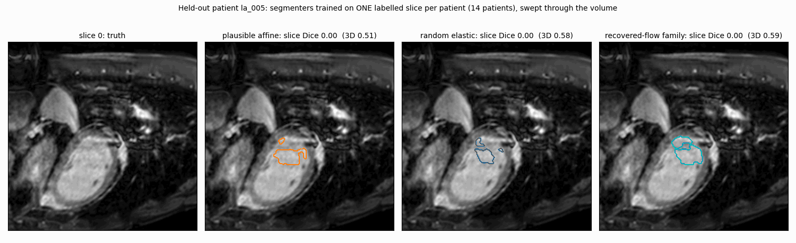
</p>

*What the numbers look like: three segmenters, each trained on one labelled slice per patient, swept
through a held-out patient (`experiments/heart/prediction_gif.py`, seed 0, a single retrain — the grid
means below are the numbers that count). All three struggle at the ends of the volume, where the atrium is
small and the aorta looks similar; the flow-trained model holds on longest.*

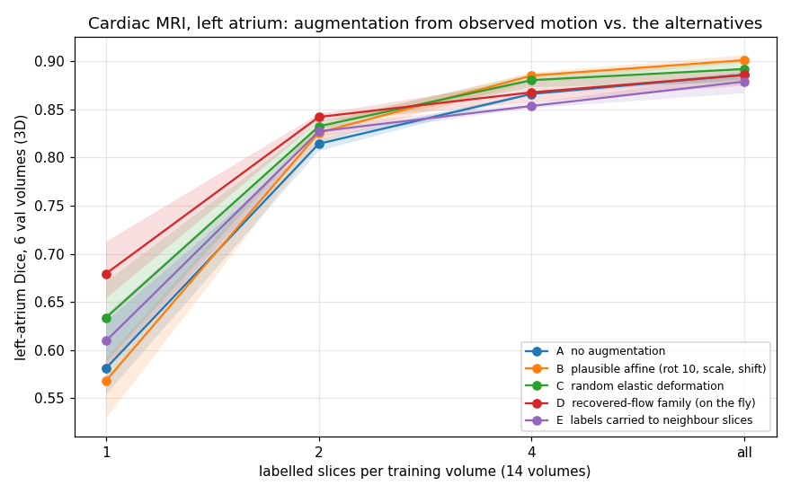

| labelled slices / patient | none | plausible affine | random elastic | **recovered-flow family** | labels to neighbours |
|---|---|---|---|---|---|
| 1 | 0.581 ± 0.035 | 0.568 ± 0.028 | 0.634 ± 0.035 | **0.680 ± 0.025** | 0.610 ± 0.022 |
| 2 | 0.814 ± 0.005 | 0.826 ± 0.008 | 0.833 ± 0.004 | **0.842 ± 0.003** | 0.827 ± 0.005 |
| 4 | 0.866 ± 0.001 | **0.885 ± 0.004** | 0.880 ± 0.006 | 0.868 ± 0.010 | 0.854 ± 0.002 |
| all (~65) | 0.886 ± 0.003 | **0.901 ± 0.004** | 0.892 ± 0.010 | 0.886 ± 0.008 | 0.879 ± 0.009 |

**Against my criteria.** At one labelled slice per patient the recovered-flow family is the best of the
five arms: **+11.1 Dice points over plausible affine** (H1, supported, seed ranges disjoint), **+7.0 over
carrying labels to neighbouring slices** (H3, supported, disjoint) and **+4.6 over random elastic
deformation** (H2: clears the 2-point bar on the mean, but one elastic seed lands above one flow seed, so
supported with overlap). At two slices it is still first (0.842, ±0.003 across seeds) but every
augmentation is within 1.6 points of every other. At four and all slices the advantage is gone and plausible
affine leads (H4). Plausible affine — small rotations and shifts — is *worse than no augmentation* at one
slice per patient.

Read together with DAVIS: **on natural video, where flipping a bear gives a valid bear, augmentation from
observed motion loses to cheap flips; on anatomy, where the same flips produce impossible patients, it is
the best option when labels are scarcest, and the advantage fades as labels accumulate.** That is the claim
I made in 2020, tested in the setting I made it for, holding where it should and not where it should not.

Two implementation details were decisive, and both came from the dissertation itself: on MRI the
coarse-to-fine pyramid that helps on video *hurts* (garbage on the textureless blood pool), so I used
single-scale Horn–Schunck, my own setting in 2020; and the raw field has to be Gaussian-smoothed before use
(§4.2), which also improved its reconstruction of the neighbouring slice from +3.3 to +4.4 dB. All 3,804
slice flows cleared the acceptance gate (mean +3.9 dB over doing nothing).

## The inverse problem itself

`python scripts/run_experiments.py` (≈35 s), 128×128 smooth random texture. Endpoint error (EPE) is the mean
|estimated − true| displacement in pixels, excluding an 8-px border.

<details>
<summary>Flow recovery, regularisation sweep, pyramid vs. single scale, convergence, interpolation</summary>


*A 2.5° rotation recovered by coarse-to-fine Horn–Schunck: EPE 0.096 px on a field of mean magnitude 1.9 px.*

**The regulariser is a bias–variance knob, and α is dimensionful.** α² competes with `I_x² + I_y²`, so the
right value scales with the image's intensity range; `α = 0.1` assumes images in [0, 1]. For a uniform
translation the true field is perfectly smooth and more regularisation is always better (EPE 0.006 px at
α = 1); for rotation the curve turns (best α ≈ 0.56, EPE 0.056 px).


**Linearised brightness constancy breaks past ~2 px; a pyramid fixes it.**

| true displacement | single scale | pyramid (3 levels) |
|---|---|---|
| 0.5 px | **0.016** | 0.072 |
| 2 px | 0.176 | **0.107** |
| 4 px | 1.018 | **0.177** |
| 8 px | 4.021 | **0.304** |


**Convergence slows as α grows** (Jacobi propagates information one pixel per sweep).


**Forward propagation beats blending for frame interpolation.** At t = 0.5 of a 4° rotation: linear blend
35.4 dB, upwind advection 42.1 dB, semi-Lagrangian along the *estimated* flow 56.2 dB.


</details>

## Run it on your own frames

```bash
pip install -e ".[dev]"
python scripts/augment_pair.py frame0.png frame1.png --out out/
```

Any two successive frames (colour is converted to grey, and the longer side is downscaled to `--max-size`,
default 384). Writes the recovered flow, the ε-homotopy as PNG and GIF, `--n` localised family members, the
four area-preserving perturbations applied at the point of largest motion, and `flow.npz` for your own
experiments. `--width`, `--gain`, `--amplitude` control the window size, how much the windowed region
moves, and the perturbation strength.

```bash
pytest                               # 34 tests, ~4 s
python scripts/run_augmentation.py   # figures for ch. 3–4
python scripts/run_experiments.py    # figures for the inverse problem
```

```python
from ofi import make_phantom, make_pair, rigid_flow, horn_schunck_pyramid, propagate_semi_lagrangian
from ofi.augment import scale_flow, localized_family, area_preserving_perturbation, SHEAR, propagate_ode

ph = make_phantom((160, 160))
_, finv = rigid_flow(ph.shape, angle_deg=8, dx=4, dy=-3)
i0, i1 = make_pair(ph, finv)                           # exact ground truth
u, v = horn_schunck_pyramid(i0, i1)                    # inverse problem

half = propagate_semi_lagrangian(i0, *scale_flow(u, v, 0.5), 1.0)        # 3.1
members = localized_family(u, v, n=5, width=16, rng=0)                    # 3.2
du, dv = area_preserving_perturbation(ph.shape, SHEAR, (60, 90), 16, 5)   # 4.5
sheared = propagate_ode(i0, u + du, v + dv, 1.0, method="midpoint")
```

## Layout

```
ofi/
  synthetic.py      textures, phantoms, analytic motions with exact flow, image pairs
  horn_schunck.py   single-scale solver + coarse-to-fine pyramid
  propagate.py      upwind and semi-Lagrangian transport
  augment.py        ch. 3-4: homotopy, localisation, advection norms, pixel-movement ODE,
                    hybrid loop, area-preserving generators and their windowed extension
  labels.py         transporting segmentation labels along a flow
  video.py          video I/O, subject tracker, synthetic-clip family
  metrics.py        endpoint error, angular error, PSNR
scripts/
  run_augmentation.py   figures and numbers for ch. 3-4
  run_experiments.py    figures and numbers for the inverse problem
  augment_pair.py       the pipeline on two frames of your own
  augment_video.py      the pipeline streaming over a video
  synthesize_video.py   new frames (validated on held-out frames, slow motion) and new clips
  propagate_labels.py   labels carried through video and onto synthetic clips
experiments/
  downstream/           the DAVIS test (pre-registered in docs/downstream_plan.md)
  heart/                the cardiac MRI test (pre-registered in docs/downstream_heart_plan.md)
tests/                  34 tests on synthetic ground truth, one per claim above
```

## Background

The dissertation was motivated by segmentation of pelvic MRI (a UT Arlington – UT Southwestern Radiology
and Urology collaboration), where labelled training data is scarce and standard augmentation ignores
whether a rotation or shear is anatomically viable. Two applications: generating deliberately modified but
geometry-respecting synthetic slices for training, and approximating intermediate slices between acquired
ones. The clinical data cannot be shared, so this repository demonstrates the methods on synthetic scenes
where the truth is known exactly, on public video, and on a public cardiac MRI set.

- J. Montalbo, *Inverse Problems and Forward Propagation of Optical Flow*, PhD dissertation, UT Arlington, 2020.
  [MavMatrix](https://mavmatrix.uta.edu/math_dissertations/241).
- B. K. P. Horn and B. G. Schunck, "Determining optical flow," *Artificial Intelligence* 17 (1981).
- J. L. Barron, D. J. Fleet, S. S. Beauchemin, "Performance of optical flow techniques," *IJCV* 12 (1994).
- D. T. Dimitrov and H. V. Kojouharov, non-standard finite-difference schemes (the non-standard Euler step of §4.4).
- O. Ronneberger, P. Fischer, T. Brox, "U-Net," MICCAI 2015 (the elastic-deformation baseline).

MIT license.
